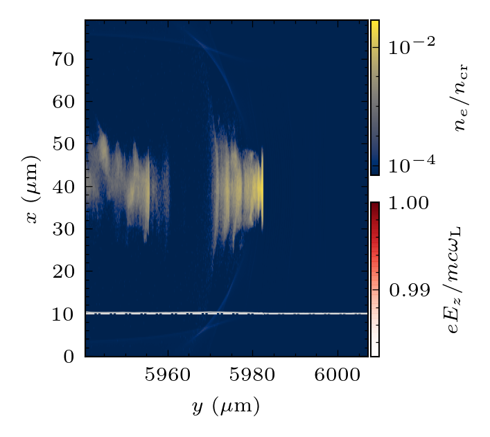

# openPMD2fortran
Convert PIC particles data from openPMD to fortran binary file

The particle data of the following LWFA from the simulation of PIConGPU-0.5.0 is used as an example. This is plotted using [rho_density_plotter](https://github.com/StevE-Ong/rho_density_plotter)



To run, `python openPMD2fortran.py`. 

One can modify the particle filtering in `select`. For example:

```
        select = {uy : [148:150]}
        openPMD2fortran('/media/ong/WORKDIR21/betatron0047_1/simOutput/h5/particles/','e_highGamma', 189600, select)
```

This will generate a Fortran binary file (unformatted) with the name `restrt{iteration}.dat`

To test if this file is correctly converted from openPMD, one needs to compile and run the file `rstrt.f`

To compile `gfortran rstrt.f`. Then run the executable `./a.out`. The file named `pospic{iteration}.dat` will be generated. The following is a plot from this file.


